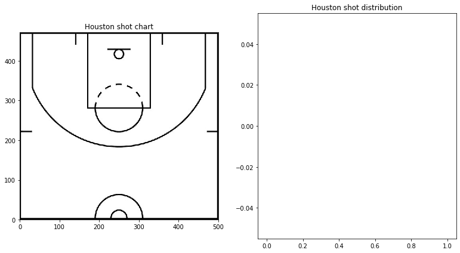
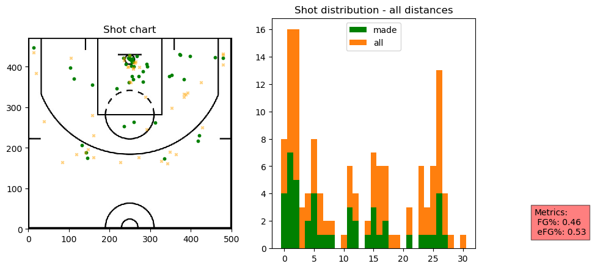
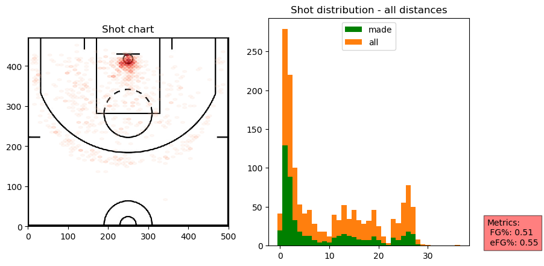
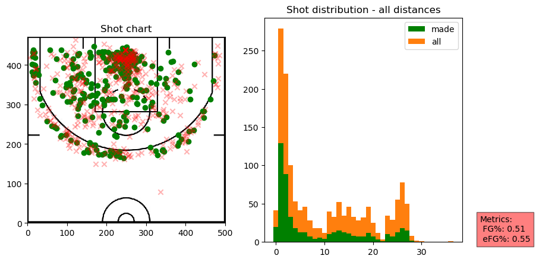

# Shot Chart
> Python module to plot NBA shot chart data and distributions for players and teams and some utilities.


This file will become your README and also the index of your documentation.

## Install

`pip install shot_chart`

## How to use

We first create a pandas dataframe from the source data.

```python
shots_df = make_df(untar_data(URLs.SHOTS_2019))
```

### Listing teams for the season

```python
list_teams(shots_df)
```


    0        New Orleans
    2            Toronto
    203        LA Lakers
    204      LA Clippers
    369          Atlanta
    370            Miami
    524           Denver
    689      San Antonio
    1030         Memphis
    1210      Sacramento
    1212        Portland
    1382         Detroit
    1383        Brooklyn
    1735      Washington
    1736       Minnesota
    1924         Orlando
    2283            Utah
    2284        Oklahoma
    2666         Phoenix
    2849        New York
    3026          Boston
    3027    Philadelphia
    3200       Cleveland
    4052         Chicago
    4053         Indiana
    4222          Dallas
    4413       Charlotte
    5972       Milwaukee
    6357         Houston
    6359    Golden State
    Name: team, dtype: object


### Listing players who took at least 1 shot for a particular team

```python
list_team_players(shots_df, 'San Antonio')
```


<div>
<style scoped>
    .dataframe tbody tr th:only-of-type {
        vertical-align: middle;
    }

    .dataframe tbody tr th {
        vertical-align: top;
    }

    .dataframe thead th {
        text-align: right;
    }
</style>
<table border="1" class="dataframe">
  <thead>
    <tr style="text-align: right;">
      <th></th>
      <th>shots_by</th>
      <th>count</th>
    </tr>
  </thead>
  <tbody>
    <tr>
      <th>2</th>
      <td>DeMar DeRozan</td>
      <td>834</td>
    </tr>
    <tr>
      <th>9</th>
      <td>LaMarcus Aldridge</td>
      <td>723</td>
    </tr>
    <tr>
      <th>0</th>
      <td>Bryn Forbes</td>
      <td>499</td>
    </tr>
    <tr>
      <th>12</th>
      <td>Patty Mills</td>
      <td>482</td>
    </tr>
    <tr>
      <th>4</th>
      <td>Dejounte Murray</td>
      <td>423</td>
    </tr>
    <tr>
      <th>14</th>
      <td>Rudy Gay</td>
      <td>397</td>
    </tr>
    <tr>
      <th>5</th>
      <td>Derrick White</td>
      <td>383</td>
    </tr>
    <tr>
      <th>15</th>
      <td>Trey Lyles</td>
      <td>250</td>
    </tr>
    <tr>
      <th>11</th>
      <td>Marco Belinelli</td>
      <td>238</td>
    </tr>
    <tr>
      <th>10</th>
      <td>Lonnie Walker</td>
      <td>228</td>
    </tr>
    <tr>
      <th>7</th>
      <td>Jakob Pöltl</td>
      <td>205</td>
    </tr>
    <tr>
      <th>1</th>
      <td>Chimezie Metu</td>
      <td>29</td>
    </tr>
    <tr>
      <th>3</th>
      <td>DeMarre Carroll</td>
      <td>29</td>
    </tr>
    <tr>
      <th>6</th>
      <td>Drew Eubanks</td>
      <td>15</td>
    </tr>
    <tr>
      <th>8</th>
      <td>Keldon Johnson</td>
      <td>5</td>
    </tr>
    <tr>
      <th>13</th>
      <td>Quinndary Weatherspoon</td>
      <td>1</td>
    </tr>
  </tbody>
</table>
</div>


### List the games for a given day

```python
list_game_ids(shots_df, 2020, 1, 20)
```


    110678    202001200ATL
    111205    202001200WAS
    111375    202001200UTA
    111554    202001200POR
    111769    202001200MIN
    111950    202001200MIL
    112120    202001200PHO
    112287    202001200MIA
    112476    202001200HOU
    112835    202001200MEM
    113200    202001200CLE
    113379    202001200BRK
    113714    202001200CHO
    113882    202001200BOS
    Name: game_id, dtype: object


Note how the game_id format is YYYYMMDD0WIN

### Plotting team shot distribution

```python
plot_team(shots_df, "Houston")
```


```python
plot_team(shots_df, "Houston", date_range=((2020,1,1), (2020,1,10)))
```


    ---------------------------------------------------------------------------

    ZeroDivisionError                         Traceback (most recent call last)

    <ipython-input-18-32ae8d8fc450> in <module>
    ----> 1 plot_team(shots_df, "Houston", date_range=((2020,1,1), (2020,1,10)))
    

    ~/DEV/shot_chart/shot_chart/core.py in plot_team(df, team, date_range, made, missed, attempt, distance)
        295     distances = shots_df['distance'].apply(lambda x: int(x.split('ft')[0])).to_list()
        296     plt.hist(distances,bins = 30)
    --> 297     fg_pct = round(_calculate_fg_pct(len(mades_df),len(shots_df)),2)
        298     efg_pct = round(_calculate_efg_pct(len(mades_df),len(mades_df[mades_df["attempt"]=="3-pointer"]),len(shots_df)),2)
        299     ax.text(45, 1, "Metrics:\n FG%: "+str(fg_pct)+"\n eFG%: "+str(efg_pct), bbox=dict(facecolor='red', alpha=0.5))


    ~/DEV/shot_chart/shot_chart/core.py in _calculate_fg_pct(fgm, fga)
        205 # Cell
        206 def _calculate_fg_pct(fgm,fga):
    --> 207     return fgm/fga*100
        208 
        209 # Cell


    ZeroDivisionError: division by zero





Please check the extra options when using the plotting functions

```python
plot_winner(shots_df, "202001200BOS")
```





```python
plot_loser(shots_df, "202001200BOS")
```


### Plotting player shot distribution

```python
plot_player(shots_df, "Damian Lillard")
```





```python
plot_player(shots_df, "Damian Lillard",date_range=1,missed=False, attempt="3-pointer")
```




